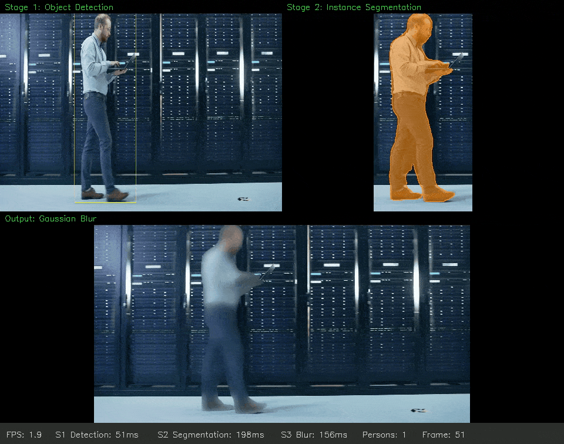
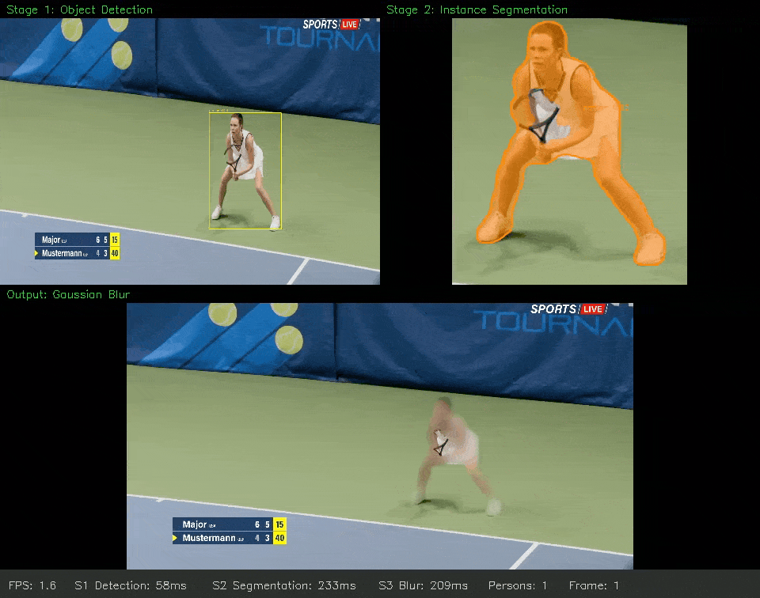
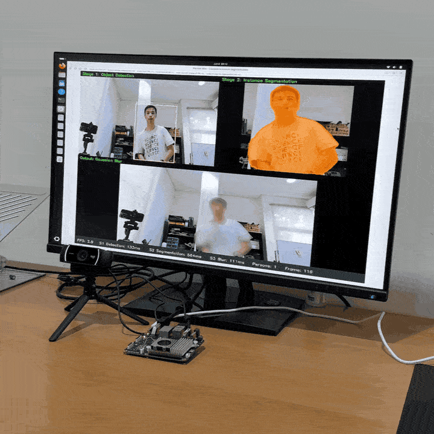
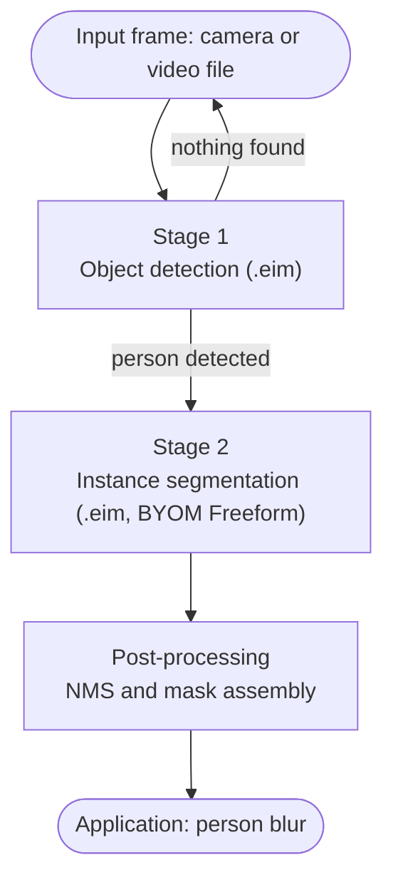
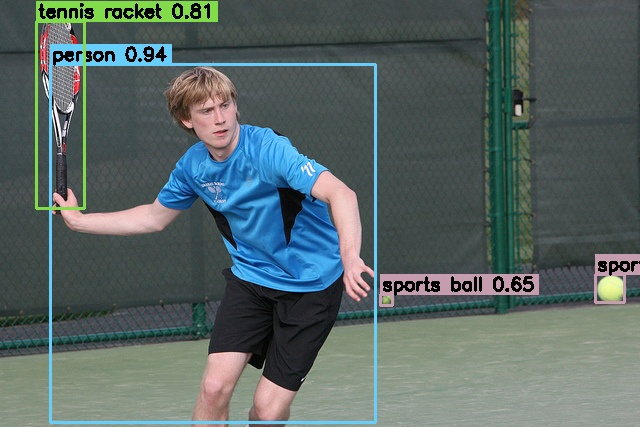
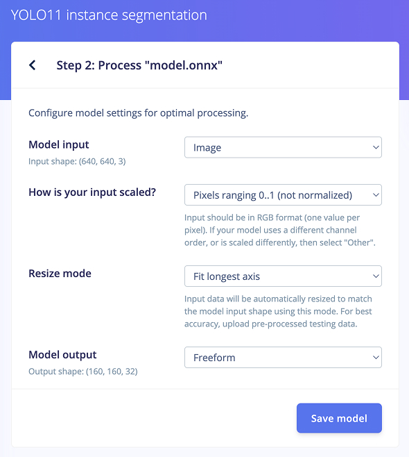
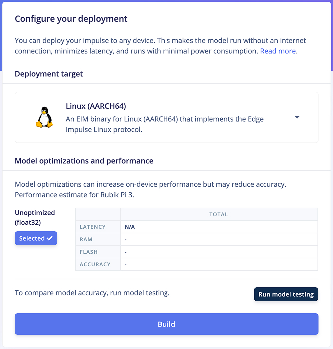
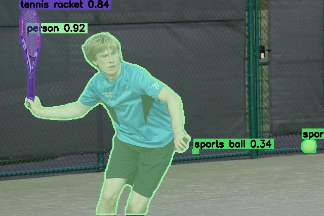
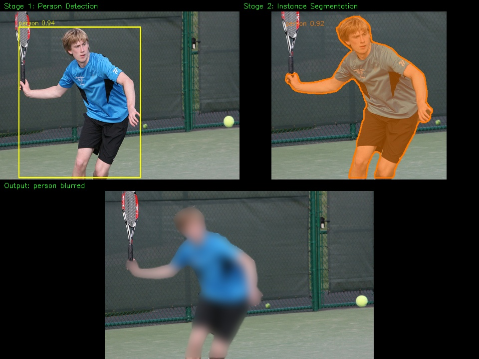
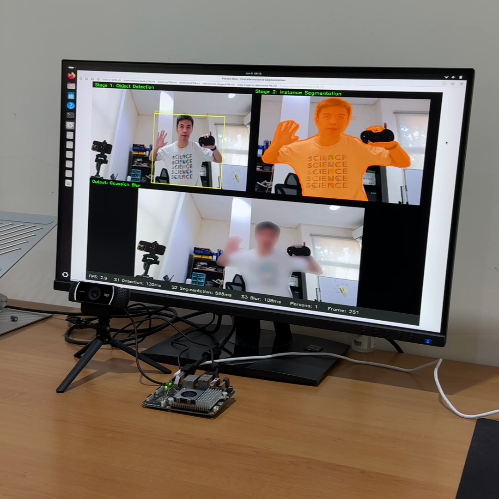

# Instance Segmentation on Edge Impulse with a Two-Stage Model Cascade

Build a vision pipeline that detects people, segments each one with a pixel-accurate mask, and blurs them for privacy. It runs through the Edge Impulse Linux runtime and is deployed on the Qualcomm Dragonwing QCS6490 (Thundercomm Rubik Pi 3).

**Created by:** Samuel Alexander  
**Object Detection (stage 1) EI project:** https://studio.edgeimpulse.com/public/717280/live  
**Instance Segmentation (stage 2) EI project:** https://studio.edgeimpulse.com/public/951718/live  
**GitHub repository:** https://github.com/SamuelAlexander/instance-seg-byom-freeform-person-blur  



## Introduction

Computer vision tasks sit on a ladder of increasing detail. **Image classification** gives a single label for a whole frame. **Object detection** draws a bounding box around each object. **Instance segmentation** goes one step further and outlines every object pixel by pixel, producing a separate mask for each instance. That extra precision is what lets you lift a single person cleanly out of a scene, trace an irregular part on a conveyor, or measure an object's true shape instead of a rectangle around it.

Edge Impulse ships classification and object detection as built-in learning blocks, but not instance segmentation. This guide adds it by combining two techniques:

- **Model cascading** chains two models so each does what it is best at. A small, fast detector runs first, and a heavier segmentation model runs only when the detector finds something worth segmenting. Each model stays simple to train and deploy, and you spend compute where it matters.
- **BYOM Freeform** ("Bring Your Own Model") lets you upload any ONNX model to Edge Impulse and have the runtime hand back its raw output tensors untouched. This is the escape hatch for deploying architectures Edge Impulse does not parse natively, such as YOLO-seg, where you do the post-processing yourself.

To keep it concrete, we build a **person-blur privacy application**: Stage 1 detects people, Stage 2 segments each one, and the app blurs them using their pixel-accurate masks so the person is hidden while the background stays sharp, which is hard to achieve with bounding boxes alone. The whole pipeline runs through the Edge Impulse Linux runtime on a Qualcomm QCS6490, and because it is built on `.eim` files, the same code runs on any Edge Impulse Linux target.



What makes this an edge AI application is that it runs live, on the device. With a USB webcam plugged into the board, the cascade processes each frame as it arrives and blurs people in real time, with no cloud round-trip. That is the whole point of running inference at the edge: the application keeps working offline, adds no network latency, and, for a privacy use case like this, raw video never leaves the device. The clip below shows the full cascade running live on the Rubik Pi 3 from a USB webcam.



### What you'll learn

- chain two models into a detection-then-segmentation cascade
- deploy a YOLO11-seg model on Edge Impulse using the Freeform output type
- turn raw segmentation tensors into instance masks with a small post-processor
- build a privacy person-blur application on top of those masks
- run the whole pipeline live on a Qualcomm QCS6490 board

> **Note:** An Edge Impulse `.eim` follows the [Edge Impulse for Linux](https://docs.edgeimpulse.com/docs/tools/edge-impulse-for-linux) protocol, so the code in this repository runs unchanged on any supported target: a Raspberry Pi 5, other Qualcomm Dragonwing boards, or a macOS laptop for development. This guide targets the QCS6490. For another board, rebuild the `.eim` for that target and keep everything else the same.

## Prerequisites

### Hardware

| Component | Used in this project | Notes |
|---|---|---|
| Board | Thundercomm Rubik Pi 3 (Qualcomm QCS6490) | Any Edge Impulse Linux target works. See the [Rubik Pi 3 page](https://docs.edgeimpulse.com/docs/edge-ai-hardware/cpu-+-ai-accelerators/thundercomm-rubikpi3). |
| USB webcam | Logitech C922 Pro Stream | Any USB UVC webcam works for live input; or run on a recorded video file instead (sample clips in `samples/`). |

### Software

- An [Edge Impulse account](https://studio.edgeimpulse.com/).
- Python 3.10+ with the runtime and OpenCV: `pip install "edge_impulse_linux>=1.2.2" opencv-python numpy`
- Ultralytics for the one-time ONNX export: `pip install ultralytics`

> **Important:** Use `edge_impulse_linux` version 1.2.2 or newer. Recent `.eim` builds return large Freeform outputs over shared memory, and older SDKs cannot read them back, so Stage 2 returns the string `"shm"` instead of tensors. More on this under [Stage 2](#large-freeform-outputs-arrive-over-shared-memory).

### Source code

The full project source is available at: https://github.com/SamuelAlexander/instance-seg-byom-freeform-person-blur  

## How the cascade works

A model cascade splits the work across two models so each one stays simple:



Stage 1 is a fast detector that answers where the objects are. Stage 2 is the heavier segmentation model that produces the masks, and it only needs to run when Stage 1 finds something. Splitting the job this way keeps each model easy to deploy, runs the expensive model selectively, and lets you replace either stage without touching the rest of the pipeline.

## Project structure

```
.
├── postprocess.py           YOLO-seg Freeform post-processor (the core of Stage 2)
├── test_eim.py              single-image .eim sanity check
├── model_metadata.json      class names and input size
├── cascade/
│   ├── cascade_inference.py two-stage cascade on a single image
│   ├── cascade_demo.py      split-view demo for video or webcam
│   └── person_blur.py       the person-blur application
├── images/                  result stills, screenshots, and GIFs used in this guide
├── samples/                 sample input frame and videos
└── models/                  .eim files, see models/README.md
```

The `models/` folder ships each `.eim` for two platforms: `*-aarch64.eim` for the Rubik Pi 3, and `*-macos-arm64.eim` for local development on Apple Silicon. See [`models/README.md`](models/README.md) for how to rebuild them.

## Set up the Rubik Pi 3

The Rubik Pi 3 is built around the Qualcomm Dragonwing QCS6490, an edge-AI SoC that combines an octa-core Kryo CPU, an Adreno GPU, and a Hexagon NPU (around 12 TOPS). That kind of on-device compute makes running a vision cascade like this at the edge practical. It runs a standard Ubuntu image, so getting it ready is quick. This section is intentionally brief; follow the linked guides for the full detail.

1. **Flash and boot** the board, then connect it to your network. See the Edge Impulse [Rubik Pi 3 page](https://docs.edgeimpulse.com/docs/edge-ai-hardware/cpu-+-ai-accelerators/thundercomm-rubikpi3) for board setup and supported deployment targets.
2. **Install the Edge Impulse Linux runtime and the Python dependencies.** The runtime is what executes the `.eim` files; see [Edge Impulse for Linux](https://docs.edgeimpulse.com/docs/tools/edge-impulse-for-linux) for details.

   ```bash
   pip install "edge_impulse_linux>=1.2.2" opencv-python numpy
   ```

3. **Copy this repository to the board** (clone it, or `scp` the folder over) and make the models executable:

   ```bash
   chmod +x models/*.eim
   ```

That is everything the board needs. From here, the commands are identical whether you run on the Rubik Pi 3 or, for development, on a macOS laptop with the bundled `*-macos-arm64.eim`.

## Stage 1: object detection

Stage 1 finds people and their bounding boxes on each frame. There are two ways to get a detector for it.

**Option A: train your own in Edge Impulse Studio.** Collect and label images, then train an object-detection model. Make sure one of your object classes is `person`, since the rest of the pipeline keys off that label. This is the standard Edge Impulse flow from data to `.eim`; see the [object detection documentation](https://docs.edgeimpulse.com/docs/edge-impulse-studio/learning-blocks/object-detection) to learn more.

**Option B: reuse a pretrained detector (what this guide does).** Running the full training pipeline is unnecessary when a well-tested model already fits. I used **YOLOX-Nano** because it is already trained on the COCO dataset, which includes a `person` class, and it performs really well. So rather than collecting data and training from scratch, I picked this model to use directly: I uploaded the pretrained YOLOX-Nano to Edge Impulse via BYOM and used Studio only to build the `.eim` deployment download. Because it is uploaded with a known output type (the YOLO parser), Edge Impulse returns parsed bounding boxes directly, which is the contrast with Stage 2's Freeform output.

Either way, any detector that recognizes your target class drops in without changing the rest of the cascade.

The fastest path is to use my detector directly: open my public [Edge Impulse project](https://studio.edgeimpulse.com/public/717280/live), clone it into your account, and build the `.eim` from **Deployment > Linux (AARCH64) > Build**. There is no need to source or upload a model yourself; the underlying detector is [YOLOX](https://github.com/megvii-basedetection/yolox). Put the downloaded `.eim` in `models/`. To check the input size and labels:

```python
from edge_impulse_linux.runner import ImpulseRunner
import json

runner = ImpulseRunner("models/stage1-yolox-aarch64.eim")
print(json.dumps(runner.init()["model_parameters"], indent=2))
runner.stop()
```



## Stage 2: instance segmentation with BYOM Freeform

This is where instance segmentation gets onto Edge Impulse. BYOM (Bring Your Own Model) lets you upload any ONNX model, and the Freeform output type tells the runtime to pass every raw output tensor straight through without parsing. You handle the post-processing, which is what makes a non-native architecture like YOLO-seg deployable.

As with Stage 1, the fastest path is to use my model directly: open my [Edge Impulse project](https://studio.edgeimpulse.com/public/951718/live), clone it into your account, and build the `.eim` from the **Deployment** tab. That lets you skip the export and upload steps below. The rest of this section shows how to build it from scratch, which is the path to take if you want to train on your own data.

### The model

A pretrained YOLO11n-seg network. It produces two output tensors:

| Tensor | Shape (640 input) | Contents |
|---|---|---|
| detections | `(1, 116, 8400)` | per anchor: 4 box values, 80 class scores, 32 mask coefficients |
| prototypes | `(1, 32, 160, 160)` | 32 mask prototype templates |

The mask for a detection is its 32 coefficients multiplied by the 32 prototypes, passed through a sigmoid, then cropped to its box.

### Export to ONNX

The export uses Ultralytics:

```python
from ultralytics import YOLO
YOLO("yolo11n-seg.pt").export(format="onnx", opset=17, dynamic=False, simplify=True)
```

### Upload as BYOM Freeform

1. Go to **Upload your model (BYOM)** and upload `yolo11n-seg.onnx`.
2. Set the model output type to **Freeform**, input to 640x640, 3 channels, scaling `0..1`.
3. Build from **Deployment > Linux (AARCH64)** and place the `.eim` in `models/`.





### Working with the raw output

Freeform gives you tensors and nothing else. Four things trip people up, and getting any of them wrong shows up as empty masks or a mask that fills the whole frame.

#### Pack RGB into one float per pixel

The Linux runner expects one `float32` per pixel, with the R, G and B values packed into the integer bits rather than three separate values:

```python
rgb = cv2.cvtColor(resized, cv2.COLOR_BGR2RGB)
r, g, b = rgb[:, :, 0].astype(np.uint32), rgb[:, :, 1].astype(np.uint32), rgb[:, :, 2].astype(np.uint32)
packed = ((r << 16) | (g << 8) | b).flatten().astype(np.float32).tolist()
```

#### Match output tensors by size, not index

Freeform does not guarantee tensor order, so identify each one by its element count:

```python
expected_det_size = (4 + num_classes + 32) * 8400      # 974400 for 80 classes
det, proto = (t0, t1) if t0.size == expected_det_size else (t1, t0)
```

#### Transpose prototype masks from NHWC to NCHW

The prototypes come back flattened in NHWC order, so reshape and transpose before using them:

```python
proto = proto.reshape(1, 160, 160, 32).transpose(0, 3, 1, 2)   # (1, 32, 160, 160)
```

#### Large Freeform outputs arrive over shared memory

To avoid serializing megabytes of JSON, recent `.eim` builds write large Freeform outputs into POSIX shared memory and return the marker string `"shm"`. Version 1.2.2 of `edge_impulse_linux` reads those segments and substitutes the real tensors for you. An older SDK leaves you with `"shm"`, so upgrade the package and no code change is needed.

### Post-processing

`postprocess.py` turns the two tensors into instance masks. It parses the detections, applies a confidence threshold and non-maximum suppression, builds each mask from the coefficients and prototypes, and resizes to the original frame:

```python
from postprocess import YOLOSegPostprocessor

pp = YOLOSegPostprocessor(num_classes=80, conf_thresh=0.25, iou_thresh=0.7, img_size=640)
results = pp.process(det_tensor, proto_tensor, orig_img_shape=(h, w))
```

To check Stage 2 on its own against a single image:

```bash
python test_eim.py --eim models/stage2-yolo11nseg-aarch64.eim --image samples/sample-frame.jpg --metadata model_metadata.json
```



## Running the cascade

`cascade/cascade_inference.py` runs both stages on one image and merges them, matching Stage 1 boxes to Stage 2 masks by IoU so the detections and masks line up:

```bash
python cascade/cascade_inference.py \
  --stage1 ./models/stage1-yolox-aarch64.eim \
  --stage2 ./models/stage2-yolo11nseg-aarch64.eim \
  --metadata ./model_metadata.json \
  --image samples/sample-frame.jpg --output result.jpg
```


On the board (set up earlier), run the cascade over a video file with the split-view demo. This path needs no display:

```bash
python cascade/cascade_demo.py \
  --stage1 ./models/stage1-yolox-aarch64.eim \
  --stage2 ./models/stage2-yolo11nseg-aarch64.eim \
  --metadata ./model_metadata.json \
  --video samples/engineer.mp4 --output cascade_demo.mp4
```

Live USB-webcam input is also supported (see [Live webcam demo](#live-webcam-demo) below), but the video-file workflow is the primary path here.

> **Note:** Developing on macOS, swap the `*-aarch64.eim` files for the bundled `*-macos-arm64.eim` and the commands are identical. If macOS reports an `.eim` as damaged, clear the quarantine flag: `xattr -d com.apple.quarantine <file>`.

## Person-blur application

`cascade/person_blur.py` uses the cascade to anonymize people. A bounding-box blur covers a rectangle and takes the background with it. An instance mask follows the body outline, so the blur lands on the person and nothing else.



The blur uses the union of all person masks as a blend map. A multi-pass Gaussian (passes set by `--blur-passes`) anonymizes faces and clothing:

```python
blurred = frame.copy()
for _ in range(passes):           # --blur-passes (default 2)
    blurred = cv2.GaussianBlur(blurred, (51, 51), 0)

combined = np.zeros(frame.shape[:2], np.uint8)
for inst in person_instances:
    combined = np.maximum(combined, inst["mask"])

m = (combined / 255.0)[:, :, None]
output = (blurred * m + frame * (1 - m)).astype(np.uint8)   # blurred on the person, sharp elsewhere
```

Run it on a clip:

```bash
python cascade/person_blur.py \
  --stage1 ./models/stage1-yolox-aarch64.eim \
  --stage2 ./models/stage2-yolo11nseg-aarch64.eim \
  --metadata ./model_metadata.json \
  --video samples/engineer.mp4 --output blurred_engineer.mp4
```

The same masks are a starting point for other applications too, such as background replacement, object removal, selective effects, or AR overlays.

### Live webcam demo



To run on a live USB webcam instead of a file, drop the `--video` flag. The preview window opens on the board's display, so launch it from a terminal on the board itself:

```bash
QT_QPA_PLATFORM=xcb python cascade/person_blur.py \
  --stage1 ./models/stage1-yolox-aarch64.eim \
  --stage2 ./models/stage2-yolo11nseg-aarch64.eim \
  --metadata ./model_metadata.json \
  --skip 5 --blur-passes 2
```

Press `q` or close the window to quit. Two flags trade quality for speed in live mode: `--skip N` runs Stage 2 (the heavy model) only every Nth frame and reuses the mask in between, while `--blur-passes` sets the blur strength. Raise `--skip` or lower `--blur-passes` for a smoother feed.

> **Note:** On a Wayland desktop (the Rubik Pi 3's default), set `QT_QPA_PLATFORM=xcb` as shown, or the OpenCV/Qt window may come up as a small black box.

For a recording of this running live on the board, see the [live demo above](#introduction).

## A note on hardware acceleration

The QCS6490 has a Hexagon NPU, which Edge Impulse can target with the **Linux (AARCH64 with Qualcomm QNN)** deployment option. The NPU accelerates int8-quantized models and suits the detection and classification style of model well.

The cascade in this guide runs on the CPU, which keeps it simple and portable across every Edge Impulse Linux target. Quantizing the Freeform segmentation model for the NPU is a worthwhile follow-up on its own, since its multi-tensor output makes int8 quantization model-specific work. Treat it as a next step once the CPU pipeline is running.

## Troubleshooting

| Symptom | Fix |
|---|---|
| Stage 2 output is the string `"shm"` | Upgrade to `edge_impulse_linux>=1.2.2`. See [shared memory](#large-freeform-outputs-arrive-over-shared-memory). |
| Empty masks, or a mask covering the whole frame | Check the tensor order (match by size) and the [NHWC to NCHW](#transpose-prototype-masks-from-nhwc-to-nchw) transpose. |
| `Model file ... is not executable` | `chmod +x models/*.eim` |
| macOS reports an `.eim` as damaged | `xattr -d com.apple.quarantine <file>` |
| Live window is a tiny black box (Wayland desktop) | Set `QT_QPA_PLATFORM=xcb` so Qt renders via XWayland. |

## Conclusion

This guide brought instance segmentation to Edge Impulse without a native learning block by pairing two ideas: a two-stage model cascade and BYOM Freeform. A fast detector locates people, a YOLO11n-seg model produces pixel-accurate masks, and a small post-processor turns the raw Freeform tensors into instances that drive a privacy person-blur application. Because every stage runs through the Edge Impulse Linux runtime as an `.eim`, the same pipeline that runs on the Qualcomm QCS6490 runs unchanged on any supported target, from a Raspberry Pi 5 to a development laptop. From here you can train Stage 2 on your own segmentation data, build other mask-driven applications such as background replacement or selective effects, or explore int8 deployment of a detection-style model on the QCS6490's Hexagon NPU.
